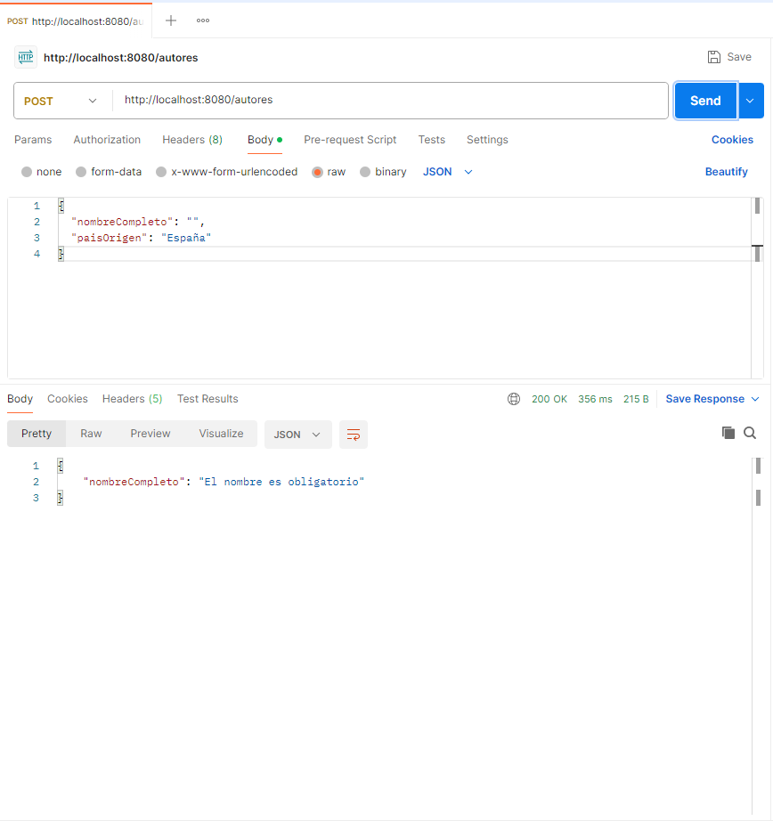

# Resultados — Bloque C‌‌‌​‌​‌‌​‍‍​‍‌​​​​​​​‌‍​‌​​​‍​​‌​​‌‌​‌‍​‌‍​​‍​‌​‌‌‌‍‌‌‌‍​‍

## Opcion elegida
Validacion

## Que implementaron
Se ha implementado validación de datos utilizando Bean Validation (Jakarta Validation) en las entidades del modelo y en los DTOs.

Se han utilizado anotaciones como:

@NotBlank → para evitar campos vacíos

@NotNull → para campos obligatorios

@Min → para validar valores numéricos

Además, se ha activado la validación en los controladores mediante @Valid, asegurando que cualquier petición incorrecta sea rechazada automáticamente.

Para mejorar la respuesta al cliente, se ha implementado un manejador global de errores con @RestControllerAdvice, que devuelve mensajes claros en formato JSON cuando ocurre un error de validación.

## Evidencia

## Codigo relevante
Validación en entidad (Autor)
@NotBlank(message = "El nombre es obligatorio")
private String nombreCompleto;

 Evita que se creen autores sin nombre.

 Activación en el controlador
@PostMapping
public Autor crear(@Valid @RequestBody Autor autor) {
return autorService.guardar(autor);
}

 @Valid activa automáticamente las validaciones.

 DTO validado (PrestamoRequest)
@NotNull(message = "El socioId es obligatorio")
private Long socioId;

@NotNull(message = "El ejemplarId es obligatorio")
private Long ejemplarId;

 Asegura que los datos mínimos necesarios se envíen.

 Manejo global de errores
@RestControllerAdvice
public class GlobalExceptionHandler {

    @ExceptionHandler(MethodArgumentNotValidException.class)
    public Map<String, String> manejarErrores(MethodArgumentNotValidException ex) {

        Map<String, String> errores = new HashMap<>();

        ex.getBindingResult().getFieldErrors().forEach(error ->
                errores.put(error.getField(), error.getDefaultMessage())
        );

        return errores;
    }
}
